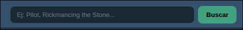
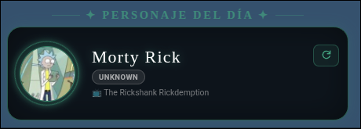
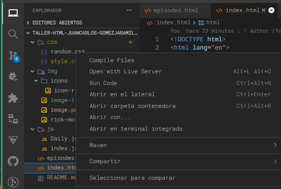

# Taller Evaluable 1 - html Juan Carlos Gomez Jaramillo
# Ingeniería Web

## Propósito del proyecto:
El repositorio contiene una aplicación web sencilla que conecta la [API](https://rickandmortyapi.com/) de Rick and Morthy. Esta consta de archivos html que renderizan así:

1. indx.html: Es la página inicial, básicamente muestra renderiza todos los personajes por medio del endpoint **Get all characters**:
      
      **GET** <https://rickandmortyapi.com/api/character>

      Esta página cuenta con un nav que permite ir entre páginas, cada pagina trae 10 personajes ubicados en dos filas. 

2. La otra página, muestra los episodios, esta se consume en el enpoint **Get all episodes**:

      **GET** <https://rickandmortyapi.com/api/episode>

      En esta página el usuario puede ver cada uno de los episodios de la serie con su número (que van desde el 1 hasta el 51), la fecha de lanzamiento del episodio y los personajes que intervienen en el episodio. Además el usuario puedo interactuar con los personjes que salen en cada uno de los episodios, al dar click sobre uno de ellos, se mostrará una pequeña tarjeta que muestran el nombre del personaje, su raza, su origen, el status y si está vivo.

      El usuario puede interactuar también buscando en el input superior digitando el nombre del episodio o una palabra clave de este.
      
      

3. Consta además, de un pequeño banner en la pagina principal que muestra de manera aleatoria uno de los personajes de la serie, en este se ve el nombre del personaje, su status y el episodio donde aparece.

      

4. Para el despliegue de la aplicacion se puede clonar el repositorio, y con la extensión de **Live Server** les das click derecho sobre el archivos **index.html** y de esta manera verás 
      la ejecución en tu servidor local:

      

      Tambien puedes verla desplegada en github pages en el siguiente enlace: **<https://202601-ingenieria-web.github.io/taller-html-juanCarlos-GomezJaramillo/>**

5. ### <em>Estructura de carpetas del proyecto:</em>

            📦css
            ┣ 📜episodes.css
            ┣ 📜random.css
            ┗ 📜style.css
            
            📦img
            ┣ 📂icons
            ┃ ┗ 📜icon-rick.png
            ┣ 📜image-1.png
            ┣ 📜image-2.png
            ┣ 📜image.png
            ┗ 📜rick-morty.png
            
            📦js
            ┣ 📜Daily.js
            ┣ 📜episodes.js
            ┗ 📜index.js

            ┣📜index.html
            ┗📜episodes.html

6. ### <em> Así luce la aplicación: </em>
      En el Header de la apiación se muestran un par de botones que indican la página en la que nos econtramos, y dando click en cualquiera de los nombres que ahí aparecen se puede navegar entre las páginas de la aplicación:

      En la página principal se muestran los personajes en grupos de 10 por página. En esta sección no hay interacción con las tarjetas. Con los botones Anterior y Siguiente se pueden ver más personajes o volver a los anteriores, según el botón que se oprima.

7. En la página de episodios se muestran los 51 episodios que la [API](https://rickandmortyapi.com/documentation#episode-schema) retorna, y se ve de la siguiente manera:

      

      En esta sección se puede interactuar con los nombres de los personajes, al dar click sobre estos se muestra una <em>card</em> que trae la informacion del personaje sobre el que se ha dado click:

      

      También se pueden buscar episodios en el <em>input</em>, el usuario puede buscar por una palabra clave o el nombre completo del capitulo que este buscando, y se puede volver a lista de episodios desde el botón de volver:

     

     Ambas páginas contienen un <em>footer<em> con un enlace a la documentación de [API](https://rickandmortyapi.com/documentation#episode-schema)

     
